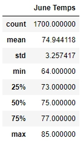
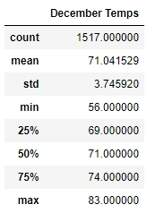
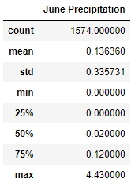
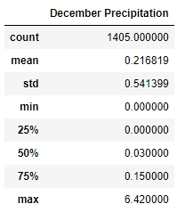

# Surfs Up
## Overview
The purpose of this analysis is to gain temperature information in Oahu for June and December in order to aid to see if ice cream shop business will be sustainable all year round. <br> 
## Results
  <br>
* The minimum temperature in December is 8 degrees lower than June
* The average temperature in December is almost 4 degrees lower than June
*  The maximum temperature in December is 2 degrees lower than June
## Summary
Given the average temperature between June and December vary little, the ice cream shop business is expected to perform well year-round. <br>
Besides temperature, rain is another factor that can impact ice cream sales, so performing percipitation analysis, similar to temperature analysis, will aid in further determining the welfare of ice cream business year-round. <br><br>

Running 2 querries and codes below will result in following statistics for June and December precipitation

```
jun_prcp = session.query(Measurement.prcp).filter(func.strftime("%m",Measurement.date) == "06").all()
jun_prcp_df = pd.DataFrame(jun_prcp, columns= ["June Precipitation"])
jun_prcp_df.describe()
```

```
dec_prcp = session.query(Measurement.prcp).filter(func.strftime("%m",Measurement.date) == "12").all()
dec_prcp_df = pd.DataFrame(dec_prcp, columns = ["December Precipitation"])
dec_prcp_df.describe()
```

  <br>